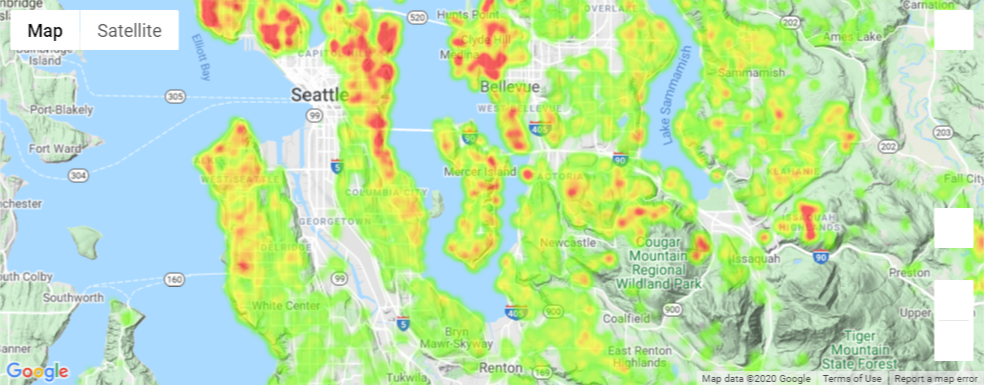
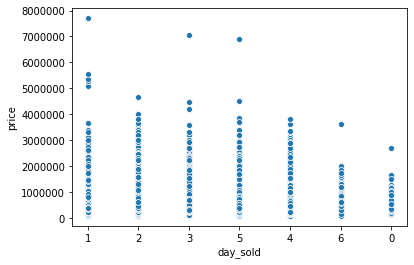
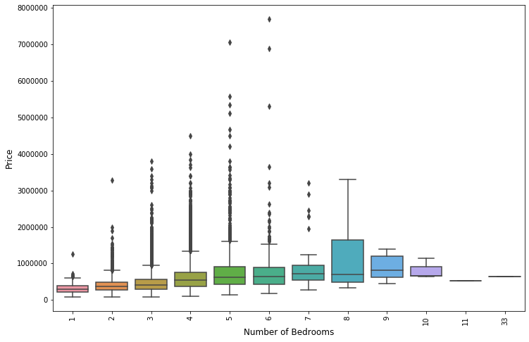
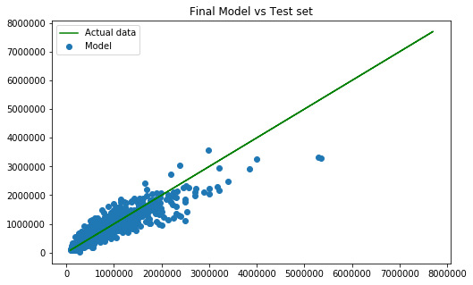

# Module 2 Final Project
Morgan Jones

## Introduction

Cocoricos is a Real Estate Tokenization platform which users can leverage to sell their property or part of their residence's income via Blockchain. With Cocoricos, real estate investors and owners are able to be guided through the legal and technical aspects of tokenizing real estate and gain access to shared house ownership. The Cocoricos platforms has tokenized house values in San Francisco, Paris, New York, London, and Tokyo among others. 

In the hypothetical business case for this project we have been **hired by Cocoricos to analyze the King County Housing Market and gather insights into the trends of the housing market**, as the Cocoricos executives are interested in launching a targeted advertising campaign in area King County area. Specifically, they would like to **target the more valuable residential properties**, as these homes would lead to more value being added to the Cocoricos blockcahin.

   Our project will be centered around **conducting statistical analysis on the prices of the King County residences**, and developing a **Multivariate Linear Regression model which can accurately predict the sale price of a house** in the area. The predictions and coefficients of our model will serve as a business solution for the Cocoricos advertising department to assess which property owners are most suitable to build their advertisement campaign for, as well as for real estate investors using the Cocoricos platform to make more informed decisions as to what houses to invest in.
   
## Objectives

For this notebook, we will build a **Multivariate Linear Regression** model to ***predict*** the ***sale price of houses*** in the King County Housing Market of Washington, USA as accurately as we can. In order to achieve this objective, we will clean, explore, and model the dataset with linear regression model. As such we will need to complete the following tasks:

 - Understand the Data: Construct a unique business case around the model. Analyze the dataset from various points of view.
 - Preprocess the Data: Import the data and preprocess the data through cleaning, scrubbing, handling missing values, and exploring different methods with benchmarking.
 - Describe the Data: Conduct EDA. Create novel distributions, compare multiple distributions, and find insights in the data.
 - Fit models and conduct Hypothesis Testing: Compare multiple models and give detailed numerical and visual analysis of models.
 - Gather insights: Give a conclusion with recommendations that are business relevant and are driven by analysis
 
## Metrics for Evaluation

There are 3 key metrics for evaluation to be used to assess if our model is considered successful. For the purposes of this notebook these will be:

***P-values***: The p-value or *probability value* is the probability of observing test results at least as extreme as the results actually observed during the test, assuming that the null hypothesis is true. For our multivariate linear regression model, we will set our *alpha value* to 0.05, equating to a *.95 probability* that the predictor is statistically significantly in effecting the price of the house.We will compare the p-values of our predictors to this alpha value so that:

> p < 0.05  The feature has a statistically significant effect on the price of a house

> p >= 0.05  The feature does not have a statistically significant impact on the price of a house and will not be included in the model.

***Coefficients***: The coefficients of the features also describe the mathematical relationship between each independent variable and the dependent variable, which in this case is the price of the house. The coefficient value demonstrates how much the mean of the target variable changes given a one-unit change in the feature variable when the other features are unchanged.  They also inform us if there is a positive or negative correlation between the features and target. For our notebook, we will assess the coefficients of our features to ensure we have features that are relevant to the price the houses.

***Adjusted R^2***: The Adjusted R^2 is a key metric for evaluation of a multivariate linear regression model, as it accounts for the number of predictors in a model when calculating the model's goodness-of-fit. It is a more accurate measure for assessing if our model explains changes in the dependent variable. The goal for our model will be **Adjusted R^2 >= 0.75**, where an Adjusted R-squared value of say 0.75 can be described conceptually as: 

> ***75% of the variations in dependent variable y are explained by the independent variables in our model.***
 
## Dataset

**Name** | **Description** | **Target/Feature** | **Cat/Num** | **Expected Datatype**
:------------ |:--------------------------|:--------------:|:-------------:|-----------:
`id` | Unique identifier for a house | Feature | Numeric | `int`
`dateDate` | Date the house was sold | Feature | Numeric | `datetime`
`pricePrice` | Price the house was sold for | **Target** | Numeric | `int`
`bedroomsNumber` | Number of bedrooms in the house | Feature | Numeric | `int`
`bathroomsNumber` | Number of bathrooms in the house | Feature | Numeric | `float`
`sqft_livingsquare` | Square footage of the house | Feature | Numeric | `int`
`sqft_lotsquare` | Square footage of the entire lot | Feature | Numeric |`int`
`floorsTotal` | Number of floors (levels) in house | Feature | Numeric |`float`
`waterfront` | If a house has a view of a waterfront | Feature | Categorical |`float`
`view` | Number of times a house has been viewed | Feature | Categorical |`float`
`condition` | A rating of the overall condition of the house | Feature | Numeric |`int`
`grade` | Overall grade given to the housing unit, based on King County grading system | Feature | Numeric |`int`
`sqft_above` | Square footage of house apart excluding basement | Feature | Numeric |`int`
`sqft_basement` | Square footage of the basement | Feature | Numeric |`int`
`yr_built` | Year the house was built | Feature | Numeric | `int`
`yr_renovated` | Year the house was renovated | Feature | Numeric | `int`
`zipcode` | Zipcode of the house's address | Feature | Categorical | `int`
`lat` | Latitude coordinate | Feature | Numeric |`float`
`long` | Longitude coordinate | Feature | Numeric | `float`
`sqft_living15` | The square footage of interior housing living space for the nearest 15 neighbors | Feature | Numeric |`int`
`sqft_lot15` | The square footage of the land lots of the nearest 15 neighbors | Feature | Numeric |`int`
 
## Target Questions

##### 1. What areas have the highest average price per house?

We have explored the `lat`, `long`, `zipcode`, `region`, and street/city features of our houses as they relate to price. The results from our exploration inform us that:

   - Lat: Houses **above the latitude line 47.5** have a higher price on average
   - Long: Houses **west of longitude line -122.1** have a higher average price 
   - Zipcode: Zipcodes belonging to **Seattle and Bellevue** have a higher average price
   - Region: Houses in the **Northwest region** of King County have the highest average price
   - Street: **Evergreen Point Rd of Medina and W Lake Sammamish Pkwy SE of Bellevue** contain the most counts of valuable houses in King County.
   - City: Most of the highest priced houses are in **Seattle and Bellevue**, with the two cities combining for half of the top 100 most expensive properties. The highest price value is in Seattle, however Seattle contains 41.5% of the houses

Q1 Recommendations
> The ad team can focus marketing in the Northwest region of King County around Seattle and Bellevue, using commercials, newspapaer/magazine ads, billboards, and special offers for residents in these areas. This could attract the property owners in the highest valued areas.

##### 2. How does time impact the sale of a house?

Our exploration of the temporal features has yielded several insights for real estate investors. After analyzing the days of the week, months, and seasons we can assert that:

   - Days of the week: **Tuesday and Wednesday** each having 21% of the sales of houses in King County.
   - Months: **May and April** have the highest count of house sales, with January and February having the lowest amount of house sales.
   - Seasons: Spring and Summer, with their combined 60% market share have the highest counts of house sales of all the seasons in King County.
   
Q2 Recommendations
> The ad team could focus on preparing their advertisement campaign for May and April when the highest amount of house transactions are made throughout the year, and stay away from marketing during January and February.

##### 3. How does bedroom count effect house price?

Our analysis of house bedroom data showed that Here we can see a difference in that:
    
   - Over 75% of the most expensive properties in King County have 4-5 bedrooms while over 75% of all houses in King County have 3-4 bedrooms.
   
Q3 Recommendations
> In the future the Cocoricos marketing team could gather data on new properties being built with these numbers of bedrooms in order to focus their resources on the houses most likely to sell for higher prices.

## Final Model Comments

𝐴𝑑𝑗𝑅2  = 0.839

We were able to increase our Adj R Sqaured value by an entire tenth through rigorous experimentation. 
>83.9% of the variations in price  𝑦  are explained by the features in our model.

Coefficient Comments:

Overall high values for coefficients
We have expounded on several of the original features with high coefficients in order to achieve this higher 𝐴𝑑𝑗𝑅2. The coefficients of our new features are also quite strong.

𝑝−𝑣𝑎𝑙𝑢𝑒𝑠 

All of our p-values are quite low, letting us know that our features are doing their job of informing the model as to the patterns within the price of the houses, and and are statistically significant to the variance in our dependent variable.